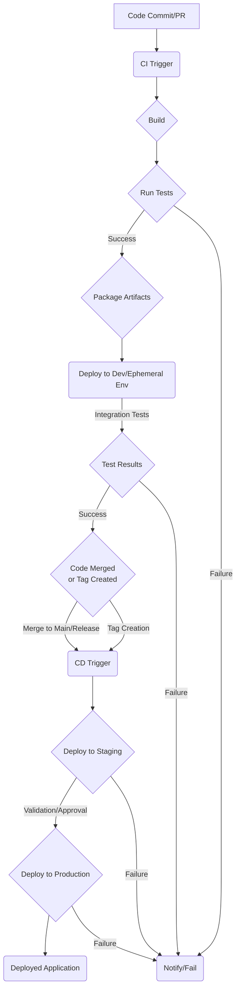

# AI Well-being Navigator - Technical DevOps Plan

## 1. Continuous Integration/Continuous Deployment (CI/CD) Pipelines

Automated pipelines for building, testing, and deploying application components.

### 1.1. Pipeline Workflow

* Source: Git repository hosting Frontend (React Native) and Backend (Python) codebases.
* Triggers:
  * Code push to main branches (`main`, `release/*`).
  * Pull/Merge Request creation or update against main branches.
  * Creation of Git tags (for release builds).
* Stages:
  1. Build: Compile source code, generate build artifacts.
  2. Test: Execute unit, integration, and potentially static analysis/security tests.
  3. Package: Create deployable packages (e.g., container images for backend, app bundles for mobile).
  4. Deploy (CI): Deploy to ephemeral environments for PR/branch validation, run integration tests.
  5. Approval (if applicable): Manual or automated approval gate for Staging/Production deployments (e.g., upon merge to `main`).
  6. Deploy (CD): Deploy packaged artifacts to target environments (Staging, Production).



* Frontend (React Native): Separate pipelines for iOS and Android builds.
  * Requires environments with Xcode (macOS agents) for iOS and Android SDK for Android.
  * Build Artifacts: `.ipa` (iOS), `.apk` or `.aab` (Android).
  * Deployment Target: App Store Connect (iOS), Google Play Console (Android) - typically manual steps or via CI integration post-build/test.
* Backend (Python):
  * Build Artifact: Docker container image or application package (e.g., wheel).
  * Deployment Target: Cloud environment (VMs, Containers, Serverless).

### 1.2. Recommended Tools

* CI/CD Platform: GitHub Actions (integrated with GitHub source control). Provides hosted runners (including macOS for iOS builds), workflow definition in YAML, and environment management.
* Build Tools:
  * Frontend: Xcode (iOS), Gradle (Android). React Native CLI.
  * Backend: Python packaging tools (`setuptools`), Docker.
* Testing Frameworks:
  * Frontend: Jest, React Testing Library (for UI components), Detox/Appium (for E2E - future).
  * Backend: `unittest`, `pytest`.
* Static Analysis/Security: Linters (e.g., `flake8`, `pylint` for Python, ESLint for JS/TS), SAST tools (integrated as CI steps).
* Artifact Registry: Docker Registry (e.g., Amazon ECR) for backend images. Versioning mobile artifacts requires storing them securely after build.

### 1.3. Artifact Management and Versioning

* Versioning: Use Git tags (`vX.Y.Z`) for marking release points. CI/CD pipeline can automatically tag container images or mobile builds with the corresponding Git tag or commit hash.
* Backend Artifacts: Docker images tagged with Git tag/commit hash. Stored in a secure Docker Registry.
* Frontend Artifacts: Mobile bundles (`.ipa`, `.aab`) stored in artifact storage (e.g., S3) before uploading to app stores. Versioned using app version number derived from Git tag.

```yaml
# Example .github/workflows/backend-ci.yml snippet
name: Backend CI

on:
  push:
    branches: [ main ]
  pull_request:
    branches: [ main ]

jobs:
  build_and_test:
    runs-on: ubuntu-latest
    steps:
    - uses: actions/checkout@v3
    - name: Set up Python
      uses: actions/setup-python@v4
      with:
        python-version: '3.x'
    - name: Install dependencies
      run: pip install -r backend/requirements.txt
    - name: Run linting and tests
      run: |
        flake8 backend/
        pytest backend/tests/

  package_and_push:
    needs: build_and_test
    if: github.event_name == 'push' # Only on push to main for now
    runs-on: ubuntu-latest
    steps:
    - uses: actions/checkout@v3
    - name: Build Docker image
      run: docker build -t ai-wellbeing-backend:${{ github.sha }} ./backend
    - name: Log in to Docker Registry
      env:
        AWS_ACCESS_KEY_ID: ${{ secrets.AWS_ACCESS_KEY_ID }}
        AWS_SECRET_ACCESS_KEY: ${{ secrets.AWS_SECRET_ACCESS_KEY }}
        AWS_REGION: us-east-1 # Or relevant region
      run: aws ecr get-login-password --region $AWS_REGION | docker login --username AWS --password-stdin <YOUR_ECR_REGISTRY_URI>
    - name: Push Docker image
      run: docker push <YOUR_ECR_REGISTRY_URI>/ai-wellbeing-backend:${{ github.sha }}
```

## 2. Deployment Strategies

Defines how application components are released to different environments.

### 2.1. Target Environments

* Development: Ephemeral environments for Pull Requests, feature branches. Used for isolation and testing during development.
* Staging: Environment mirroring Production configuration and data structure (potentially with anonymized data). Used for final testing, UAT, and performance checks.
* Production: Live environment serving end-users.

### 2.2. Chosen Deployment Strategy

* Backend API: Rolling Updates. New version gradually replaces old version instances. Suitable for stateless services. Provides zero-downtime deployment if load balancer health checks are configured correctly.
  * *Justification:* Simplifies initial deployment complexity while providing acceptable availability.
  * *Future Consideration:* Blue/Green or Canary deployments for higher-risk changes or features requiring phased rollout/A/B testing.
* Mobile Frontend (iOS/Android): App Store Deployment. Builds are submitted to Apple App Store and Google Play Store. Users update the application via the respective app stores.
  * CI/CD packages and potentially uploads to the stores (or prepares for upload), but the final release decision is typically separate (manual or triggered).

### 2.3. Rollback Procedures

* Trigger: Significant increase in error rates, performance issues, or critical bug detection in the new deployment. Monitored metrics and alerts define "significant".
* Backend API: Automated rollback to the previous stable version. The deployment system should retain previous container image versions. Rollback involves deploying the previous version using the same Rolling Update strategy.
* Mobile Frontend: Not directly rollbackable post-release. Requires submitting a new version (either a patched forward fix or reverting to a previous codebase version and releasing). Critical issues might necessitate disabling backend features or displaying maintenance messages in the app.

## 3. Infrastructure Considerations

Underlying infrastructure requirements to support the application.

### 3.1. Cloud Provider

* Recommendation: Amazon Web Services (AWS).
* *Justification:* Provides a wide range of services suitable for scalable web/mobile backends (compute, database, storage, networking, security), strong compliance offerings, and maturity. Integration with mobile push notifications (FCM on Android uses Google infrastructure, APNS on iOS uses Apple infrastructure; AWS SNS can orchestrate sending to both).

### 3.2. Infrastructure-as-Code (IaC) Strategy

* Strategy: Full infrastructure provisioning and management using IaC.
* Tool: Terraform.
* *Justification:* Supports multi-cloud (future-proofing), declarative syntax, state management. Enables versioning, collaboration, and reproducibility of infrastructure environments.
* Scope: VPC, subnets, security groups, load balancers, compute resources (EC2, ECS, Fargate), database instances (RDS), scaling policies, monitoring setup.

```terraform
# Example Terraform snippet (simplified)
resource "aws_vpc" "app_vpc" {
  cidr_block = "10.0.0.0/16"
  tags = {
    Name = "ai-wellbeing-navigator-vpc"
  }
}

resource "aws_subnet" "app_public_subnet" {
  vpc_id     = aws_vpc.app_vpc.id
  cidr_block = "10.0.1.0/24"
  availability_zone = "us-east-1a" # Example AZ
  map_public_ip_on_launch = true
  tags = {
    Name = "app-public-subnet-1a"
  }
}

resource "aws_security_group" "app_sg" {
  vpc_id = aws_vpc.app_vpc.id
  description = "Allow HTTP/HTTPS inbound traffic"
  ingress {
    description = "HTTPS from Internet"
    from_port   = 443
    to_port     = 443
    protocol    = "tcp"
    cidr_blocks = ["0.0.0.0/0"]
  }
  # Add other rules as needed (e.g., database access from app servers)
  tags = {
    Name = "ai-wellbeing-app-sg"
  }
}
```

### 3.3. Scalability and High-Availability Architecture

* Backend API:
  * Compute: AWS ECS Fargate (Serverless Containers) or EC2 Auto Scaling Group running Docker containers. Recommended Fargate for reduced operational overhead.
  * Scaling: Configured auto-scaling policies based on CPU utilization, request count per target.
  * Load Balancing: AWS Application Load Balancer (ALB) distributing traffic across container instances/EC2 instances in multiple Availability Zones (AZs).
* Database (PostgreSQL): AWS RDS Multi-AZ deployment. Provides synchronous replication to a standby instance in another AZ for high availability and automatic failover. Read Replicas can be added for read scaling if needed (Analytics Module might benefit).
* Content Delivery: AWS S3 for static assets (images, audio files). Configured as a static website or served via CloudFront CDN for caching and global distribution (#2, #5).
* Networking: Multi-AZ VPC setup. Public subnets for Load Balancers, private subnets for application instances and databases.

### 3.4. Networking Configuration

* VPC: Single VPC spanning multiple Availability Zones (AZs).
* Subnets:
  * Public Subnets: Host public-facing resources like ALBs.
  * Private Subnets: Host application instances, databases. Traffic routed via NAT Gateway in public subnet to access the internet (for updates, external services).
* Security Groups: Act as stateful firewalls.
  * ALB Security Group: Allows inbound traffic on 443 (HTTPS) from the internet (0.0.0.0/0).
  * App Security Group: Allows inbound traffic on the application port (e.g., 8000) *only* from the ALB Security Group. Allows outbound to database SG, secrets manager, etc.
  * Database Security Group: Allows inbound traffic on PostgreSQL port (5432) *only* from the App Security Group.
* Bastion Host: A hardened EC2 instance in a public subnet (with strict security group allowing SSH only from trusted IPs) used to securely access instances in private subnets for maintenance/troubleshooting.

### 3.5. Disaster Recovery and Business Continuity

* Database: AWS RDS automated backups (snapshots) and point-in-time recovery. Multi-AZ provides high availability, reducing recovery time in single-AZ failure scenarios. Cross-region replication can be configured for disaster recovery against regional outages.
* Application: Deploy application across multiple AZs using Auto Scaling Groups or ECS Fargate. Configuration and code stored in Git. IaC (Terraform) allows quick rebuilding of infrastructure. Application data (user uploaded, etc. if any beyond DB) needs separate backup strategy (e.g., S3 versioning, cross-region replication).
* RTO/RPO: Not specified in PRD. Standard configuration (Multi-AZ RDS, multi-AZ application deployment) provides RTO (Recovery Time Objective) typically minutes-to-low-hours and RPO (Recovery Point Objective) minutes for database. More stringent RTO/RPO would require warm/hot standby environments in separate regions.

## 4. Monitoring and Logging

Establishing visibility into application health, performance, and issues.

### 4.1. Key Metrics to Monitor

* Application Health:
  * Backend API: HTTP 5xx error rate, latency (P95, P99), request count, number of healthy instances behind load balancer.
  * Database: CPU utilization, memory utilization, database connections, read/write IOPS, free storage space, error logs.
  * Mobile Frontend: Crash rate (crashes per user session), ANRs (Android), memory warnings (iOS).
* Performance:
  * Backend API: Latency per endpoint (#3, #5, #6, #9, #10, #13 API calls are critical).
  * Database: Slow queries.
  * Frontend: App launch time, screen load times, audio playback buffering (#5).
* System Resources: CPU, Memory, Disk I/O, Network In/Out for backend instances.
* Business/Feature Metrics: User signup rate, check-in completion rate (#3), coping tool usage (#5, #6), community post/reply rate (#9), notification delivery rate (#11). *Requires integration with Analytics Module for collection.*

### 4.2. Recommended Monitoring Tools

* Cloud-Native: AWS CloudWatch (metrics, logs, alarms), AWS X-Ray (request tracing for latency analysis).
* Dashboarding: Grafana (can integrate with CloudWatch, Prometheus).
* Application Performance Monitoring (APM): AWS X-Ray or third-party tools like Datadog, New Relic (for detailed transaction tracing and mobile monitoring).

### 4.3. Centralized Logging Strategy and Tools

* Strategy: Aggregate logs from all application components (backend instances, database, load balancers) into a central system.
* Backend Logs: Configure application logging to output to standard output/error. For containerized apps (Fargate/ECS), configure logging driver (e.g., `awslogs`) to send logs to CloudWatch Logs.
* Database Logs: Configure RDS to export logs (e.g., slow query logs, PostgreSQL logs) to CloudWatch Logs.
* Load Balancer Logs: Enable ALB access logs and send to S3, potentially processed for analysis.
* Mobile Logs: Integrate mobile logging libraries to capture errors, warnings, and key events. Upload logs securely to backend or dedicated mobile analytics service on error/crash or periodically.
* Tool: AWS CloudWatch Logs for collection and retention. CloudWatch Logs Insights for querying logs.

### 4.4. Alerting Mechanisms and Incident Response

* Alerting: Configure AWS CloudWatch Alarms based on key metrics thresholds (e.g., 5xx errors > 1%, CPU utilization > 80% for extended period, database connections > 90% of max).
* Notification: Alarms trigger notifications via AWS SNS topics. SNS can fan out to email, SMS, or integrated endpoints like PagerDuty, Slack, or OpsGenie.
* Incident Response (Basic Flow):
  1. Alert is triggered and received by on-call personnel/system.
  2. Acknowledge alert.
  3. Diagnose issue using monitoring dashboards (Grafana), logs (CloudWatch Logs Insights), tracing (X-Ray).
  4. Implement mitigation steps (e.g., scaling up resources, restarting services, database failover, code rollback).
  5. Verify mitigation success via monitoring.
  6. Perform root cause analysis post-incident.
  7. Implement preventative measures (code fixes, infrastructure changes).

## 5. Security in DevOps (DevSecOps)

Integrating security practices throughout the development lifecycle and operations.

### 5.1. Integration of Security Practices into CI/CD

* Static Application Security Testing (SAST): Integrate tools into the CI pipeline (Build/Test stage) to analyze source code for common vulnerabilities (e.g., SQL injection, XSS - though less relevant for API, hardcoded secrets). Tools like SonarQube or open-source alternatives.
* Dependency Scanning: Scan project dependencies (Python packages, JS/TS libraries) for known vulnerabilities using tools like OWASP Dependency-Check, Snyk, or built-in GitHub dependency scanning. Run in CI (Build/Test stage).
* Container Scanning: If using Docker, scan built images for OS package vulnerabilities (e.g., using AWS ECR built-in scanning, Clair). Run in CI (Package stage).
* Secrets Detection: Scan code and configuration files for accidental inclusion of hardcoded secrets.
* Pre-commit Hooks: Encourage developers to use pre-commit hooks for basic checks (linting, secret scanning) before committing code.

### 5.2. Secrets Management Strategy

* Rule: No secrets (database credentials, API keys, encryption keys, third-party service credentials) are to be stored directly in source code or configuration files deployed with the application.
* Tool: AWS Secrets Manager.
* Implementation:
  * Secrets stored securely in AWS Secrets Manager.
  * Application instances (EC2, Fargate tasks) use IAM roles to grant permission to retrieve specific secrets from Secrets Manager at runtime.
  * CI/CD pipelines access secrets (e.g., for pushing Docker images) using temporary credentials or specific IAM users with restricted permissions, sourced from GitHub Actions secrets or similar secure injection mechanisms.

### 5.3. Compliance and Regulatory Considerations

* Reference: PRD mentions GDPR/CCPA/HIPAA principles.
* Technical Implications:
  * Data Encryption: Enforce encryption at rest (Database - RDS encryption, Storage - S3 encryption) and in transit (TLS 1.2+ for all API communication, internal service communication).
  * Access Controls: Implement robust Role-Based Access Control (RBAC) within the application and infrastructure layers. Principle of Least Privilege applied to IAM roles/users.
  * Audit Logging: Enable detailed logging of access to sensitive data and systems. Monitor audit logs for suspicious activity.
  * Data Minimization: Infrastructure/database design should align with storing only necessary data. Implement logic for data aggregation/anonymization where possible, as per PRD (#13, #9).
  * Data Deletion: Implement secure and verifiable data deletion procedures matching user requests (#1) and data retention policies. This includes primary database deletion and removal from backups within specified compliance windows.
  * Consent Management: The technical implementation must respect and enforce user consent flags (e.g., for Journaling insights #13, Notifications #11). Logic paths must check consent status before processing sensitive data or sending notifications.
